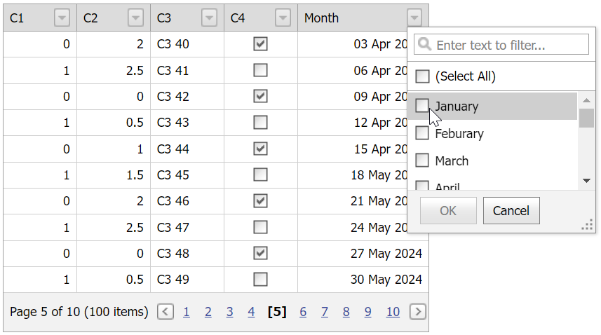

<!-- default badges list -->

[](https://supportcenter.devexpress.com/ticket/details/T328882)
[](https://docs.devexpress.com/GeneralInformation/403183)
<!-- default badges end -->
# Grid View for ASP.NET MVC - How to filter dates by month
<!-- run online -->
**[[Run Online]](https://codecentral.devexpress.com/128550079/)**
<!-- run online end -->

This example demonstrates how to create an unbound column, populate it with data from a data source, and customize header filter items. 



## Overview

Follow the steps below to filter dates by month:

1. Add an [unbound column](https://docs.devexpress.com/AspNetMvc/16859/components/grid-view/data-representation-basics/columns/unbound-columns) that stores month numbers. To enable this behavior, set the column's [UnboundType](https://docs.devexpress.com/AspNet/DevExpress.Web.GridViewDataColumn.UnboundType) to `Integer`.

    ```csharp
    settings.Columns.Add(column => {
        column.FieldName = "Month";
        column.ColumnType = MVCxGridViewColumnType.DateEdit;
        column.UnboundType = DevExpress.Data.UnboundColumnType.Integer;
        column.SettingsHeaderFilter.Mode = GridHeaderFilterMode.CheckedList;
    })
    ```

2. Handle the grid's [CustomUnboundColumnData](https://docs.devexpress.com/AspNetMvc/DevExpress.Web.Mvc.GridViewSettings.CustomUnboundColumnData) event. In the handler, get date values from the specified bound column and populate the unbound column cells with month numbers.

    ```cs
    settings.CustomUnboundColumnData = (sender, e) => {
        if (e.Column.FieldName == "Month") {
            DateTime value = (DateTime)e.GetListSourceFieldValue("C5");
            e.Value = value.Month;
        }
    };
    ```

3. To display full dates in the unbound column, handle the grid's [CustomColumnDisplayText](https://docs.devexpress.com/AspNetMvc/DevExpress.Web.Mvc.GridViewSettings.CustomColumnDisplayText) event and specify its [DisplayText](https://docs.devexpress.com/AspNet/DevExpress.Web.ASPxGridColumnDisplayTextEventArgs.DisplayText) argument property.

    ```cs
    settings.CustomColumnDisplayText = (sender, e) => {
        if (e.Column.FieldName == "Month") {
            DateTime realValue = ((DateTime)e.GetFieldValue("C5"));
            e.DisplayText = realValue.ToString("dd MMM yyyy");
        }
    };
    ```

4. Handle the grid's [HeaderFilterFillItems](https://docs.devexpress.com/AspNetMvc/DevExpress.Web.Mvc.GridViewSettings.HeaderFilterFillItems) event to add custom header filter items based specified by the month number.


    ```cs
    settings.HeaderFilterFillItems = (sender, e) => {
        if (e.Column.FieldName == "Month") {
            e.Values.Clear();
            e.AddValue("January", "1");
            e.AddValue("February", "2");
            e.AddValue("March", "3");
            e.AddValue("April", "4");
            e.AddValue("May", "5");
            e.AddValue("June", "6");
            e.AddValue("July", "7");
            e.AddValue("August", "8");
            e.AddValue("September", "9");
            e.AddValue("October", "10");
            e.AddValue("November", "11");
            e.AddValue("December", "12");
        }
    };
    ```

## Files to Review

* [_GridViewPartial.cshtml](./CS/GridViewBatchEdit/Views/Home/_GridViewPartial.cshtml)
* [Index.cshtml](./CS/GridViewBatchEdit/Views/Home/Index.cshtml)

## Documentation

* [Unbound Columns](https://docs.devexpress.com/AspNetMvc/16859/components/grid-view/data-representation-basics/columns/unbound-columns)
* [Header Filter](https://docs.devexpress.com/AspNetMvc/120468/components/grid-view/data-shaping-and-manipulation/filtering/header-filter)
